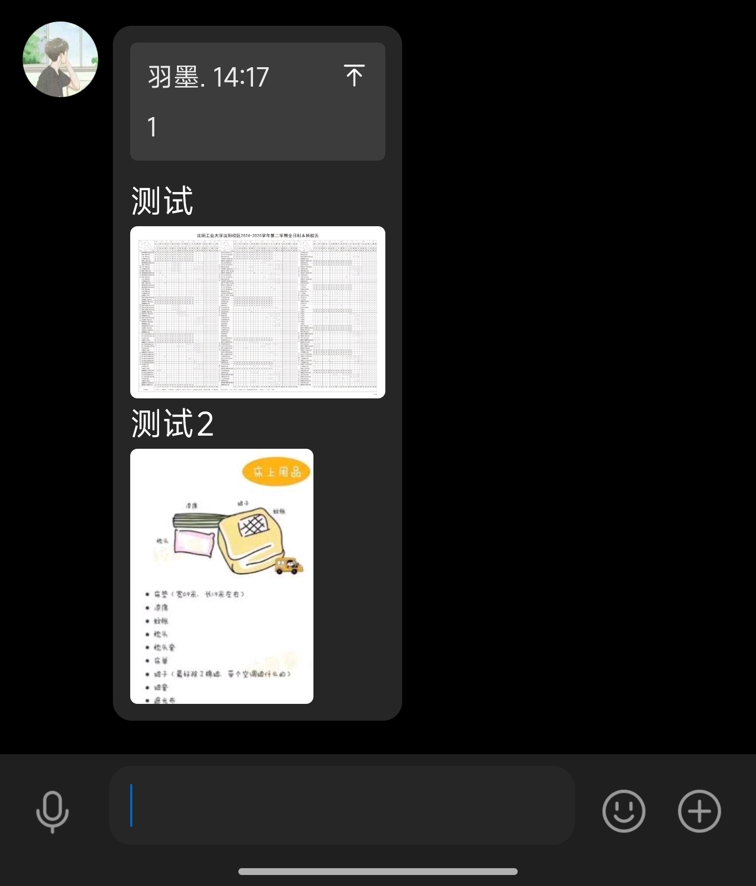
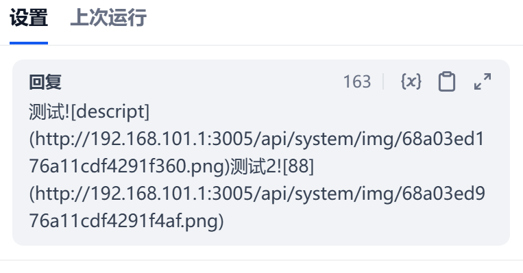

# ToImage
把ai生成的内容中形式的图片转成图片文件发给QQ
<table>
  <tr>
    <td align="center"></td>
    <td align="center"></td>
  </tr>
</table>
## 安装

配置完成 [LangBot](https://github.com/RockChinQ/LangBot) 主程序后即可到插件管理页面安装  
或查看详细的[插件安装说明](https://docs.langbot.app/plugin/plugin-intro.html#%E6%8F%92%E4%BB%B6%E7%94%A8%E6%B3%95)

## 使用

```bash
!plugin get https://github.com/yumo666666/ToImage.git
```
